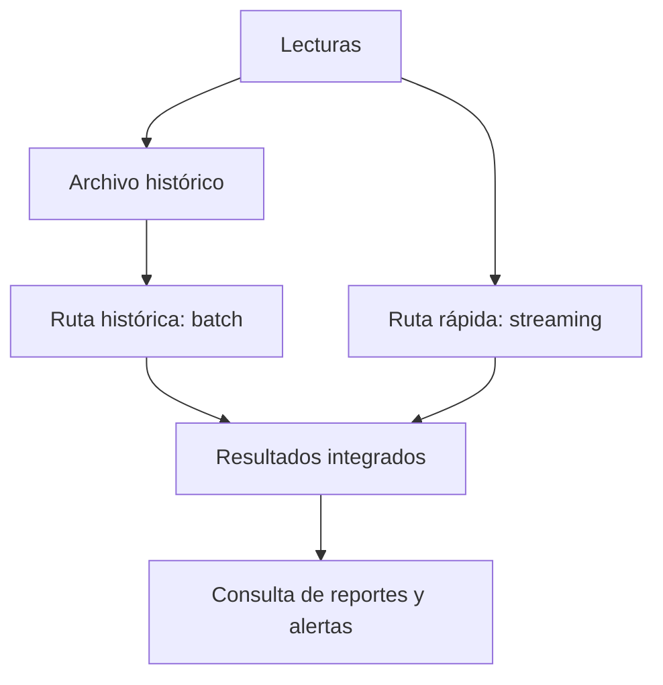
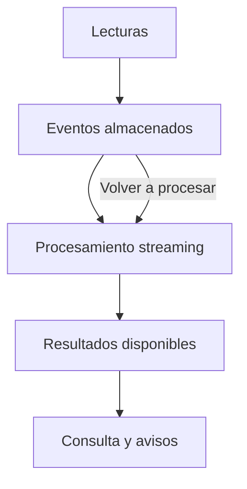

# Sensores industriales: resultados y aplicación de Big Data

**Alumna:** Vania Yoel Reséndiz Ávila
**Grupo:** IDIA 222
**Fecha:** 5 de octubre de 2026

## 5. Las cinco V

| V | Aplicación a los sensores | Ejemplo | Alcance |
|---|---|---|---|
| Volumen | Cada lectura aumenta la cantidad de información guardada. | La muestra contiene 100,000 registros de 40 sensores. | CSV actual. |
| Velocidad | Los datos llegan con cierta frecuencia y algunos necesitan una respuesta rápida. | El ejercicio registra una lectura por minuto. Si hubiera 2,000 sensores midiendo cada segundo, llegarían 172,800,000 registros en un día. | Por minuto: caso actual. Los 2,000 sensores son un supuesto para la ampliación. |
| Variedad | La empresa puede reunir información en varios formatos. | A las tablas de mediciones se sumarían fotografías y reportes escritos de mantenimiento. | La tabla está en el CSV; las imágenes y los reportes son futuros. |
| Veracidad | Antes de tomar decisiones hay que saber si las mediciones son confiables. | Se pueden buscar campos vacíos, registros repetidos y temperaturas que necesiten revisión. En operación también habría que comprobar la calibración. | Los campos del CSV permiten revisiones básicas; la calibración no está documentada en el archivo. |
| Valor | Los resultados ayudan a decidir qué revisar primero. | Planta_3 tiene 1,777 alertas, la cantidad más alta de las cuatro plantas. | Hallazgo calculado con el CSV actual. |

Los datos son simulados. El archivo no contiene fotografías, reportes de mantenimiento ni pruebas de que los sensores estén calibrados. Esos elementos pertenecen al sistema que se quiere ampliar.

## 6. Formatos de datos y límites de una computadora

| Información | Tipo | Explicación |
|---|---|---|
| CSV de mediciones | Estructurada | Cada fila usa las mismas columnas. |
| Lectura enviada en JSON | Semiestructurada | Se organiza mediante claves y valores; puede tener campos opcionales o anidados. |
| Foto de una máquina | No estructurada | Su información está en la imagen y necesita interpretarse. |
| Reporte escrito en texto libre | No estructurada | No sigue necesariamente una tabla o un conjunto fijo de campos. |

Un archivo de 100,000 filas puede seguir siendo manejable con herramientas comunes. Este CSV ocupa cerca de 4.62 MB y el programa lo procesa con Python. Para hablar de Big Data también hay que considerar cuánto crecen los datos, con qué rapidez llegan y qué recursos hacen falta para aprovecharlos.

La ampliación podría rebasar la memoria y el almacenamiento de una computadora, o hacer que el análisis termine demasiado tarde. Las fotografías agregarían más peso y otro tipo de procesamiento. Esta versión carga todas las filas en memoria; por eso no sería la mejor opción para un historial enorme. En ese caso haría falta dividir los datos, repartir el procesamiento y definir cuánto tiempo se conservarán.

## 7. Cuándo usar batch y cuándo streaming

El análisis del archivo es **batch**: las lecturas ya están guardadas y se revisan juntas. El resultado aparece después de procesar el conjunto.

Una alerta que debe llegar en pocos segundos necesita **streaming**. La temperatura se compara con 85 °C al recibir la lectura, y se envía el aviso cuando sea mayor. Esperar al cierre del día haría que el aviso llegara tarde.

El resumen del día sí puede hacerse en **batch**, al reunir las mediciones de ese periodo y calcular promedios, máximos y alertas. Conviene acordar el horario de cierre y cómo tratar las lecturas que lleguen después. La decisión depende del tiempo disponible: segundos para el aviso y hasta el final del día para el resumen.

## 8. Arquitecturas propuestas

### A. Lambda

Lambda encaja con el primer escenario: el historial se recalcula por lotes mientras las nuevas lecturas se procesan rápidamente. Ambas rutas alimentan los resultados que consulta la empresa. Una dificultad es mantener las mismas reglas en las dos rutas y evitar que se sumen dos veces las mismas mediciones.

### B. Kappa

Para el segundo escenario corresponde Kappa. Las lecturas se guardan en un registro de eventos y se procesan con una sola lógica. Si se necesita corregir una regla o reconstruir los resultados, se vuelven a leer los eventos conservados. El sistema debe guardar el historial necesario y controlar los duplicados durante el reprocesamiento.

## 9. De los resultados a las decisiones

### Analítica descriptiva

El primer hallazgo es que **6,954 de las 100,000 mediciones superaron 85 °C**, lo que representa **6.954 %** del archivo. **Planta_3** acumuló más alertas: **1,777**.

| Planta | Promedio de temperatura (°C) | Número de alertas |
|---|---:|---:|
| Planta_1 | 66.6163 | 1,737 |
| Planta_2 | 66.5350 | 1,708 |
| Planta_3 | 66.7658 | 1,777 |
| Planta_4 | 66.6690 | 1,732 |

El segundo hallazgo es la máxima de **104.99 °C**. Hay cuatro lecturas con ese mismo valor:

| Sensor | Fecha y hora | Planta | Registro |
|---|---|---|---:|
| S023 | 01/09/2026 22:23 | Planta_3 | 53743 |
| S019 | 02/09/2026 13:11 | Planta_2 | 89259 |
| S014 | 02/09/2026 15:23 | Planta_2 | 94534 |
| S030 | 02/09/2026 16:02 | Planta_3 | 96110 |

Las fechas se leen como día/mes/año. Los promedios de la tabla están redondeados a cuatro decimales.

### Analítica predictiva

La pregunta sería: **¿se puede anticipar una falla durante la siguiente semana a partir de cambios sostenidos en temperatura y vibración?**

Para estudiarla habría que agregar fechas de fallas confirmadas, mantenimiento, identificación de la máquina asociada a cada sensor, tiempo de uso y carga de trabajo. También se necesitarían periodos normales y un historial más largo. Con eso se podría probar si las tendencias ayudan a anticipar una falla, usando datos posteriores para evaluar el modelo. El CSV actual no incluye fallas confirmadas.

### Analítica prescriptiva

Ante un riesgo alto previsto por un modelo que ya haya sido evaluado, una opción sería adelantar la revisión técnica de la máquina y reservar un espacio para mantenimiento. Antes de hacerlo se revisarían las lecturas recientes, la calibración del sensor, los límites del equipo y su historial. También habría que comparar el costo de parar la producción con el riesgo de esperar, y confirmar que haya personal y refacciones.

**85 °C es el umbral didáctico del examen.** Una lectura mayor genera una alerta, pero no demuestra por sí sola que una máquina vaya a fallar.
